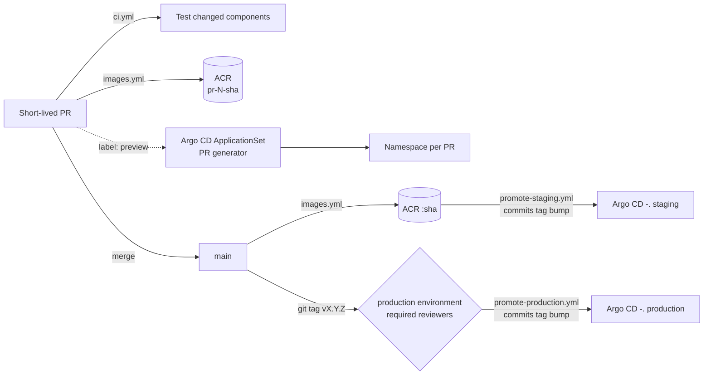

# CI/CD strategy

Trunk-based development on `main`, promoted through environments, deployed by
**Argo CD (GitOps) onto KaaS** — the internal managed Kubernetes platform run by
the EEP team that already hosts our Kotlin and React workloads.

Chosen because an agentic team opens many short-lived PRs concurrently. Long-lived
`preview` / `production` branches would force constant cross-branch merges and
serialise every change behind one shared environment.

GitHub never talks to the cluster. CI builds images and commits image tags; Argo CD
reconciles. That keeps cluster credentials out of Actions entirely.

## Flow

| Trigger | Workflow | Result |
| --- | --- | --- |
| PR | `ci.yml` | Lint/test only the changed components (path-filtered) |
| PR | `images.yml` | Pushes `pr-<n>-<sha>` images to ACR |
| PR labelled `preview` | *(none — Argo CD)* | ApplicationSet creates a `preview-pr-<n>` namespace |
| PR closed | *(none — Argo CD)* | Application and namespace pruned automatically |
| Push `main` | `images.yml` → `promote-staging.yml` | Commits new tag into `deploy/overlays/staging`; Argo CD syncs |
| Tag `v*` | `promote-production.yml` | Human approval, then commits the tag into the production overlay |

## Why there are no preview/cleanup workflows

Argo CD's ApplicationSet **PR generator** already watches open pull requests and
owns the whole lifecycle of a preview environment. GitHub workflows that created
and deleted them would duplicate that and drift from it. Previews are opt-in via
the `preview` label so speculative agent PRs don't consume cluster quota.

## Rollback

Re-run **Promote to production** via `workflow_dispatch` with the previous tag.
The images already exist in ACR, so it is a re-point, not a rebuild. Argo CD rolls
the Deployment, which is zero-downtime given a `readinessProbe` and a rolling
update strategy.

## Constraints this stack imposes

- **Mobile clients lag.** The Capacitor Android app ships through Play Store
  review and cannot be rolled back once installed, so old versions stay live for
  weeks. The backend must therefore be **additive-only / API-versioned**, and
  database changes must follow **expand → migrate → contract** (Flyway), never a
  destructive change in one release.
- **Previews must not touch real data.** PR namespaces get an ephemeral
  PostgreSQL plus stubs for the existing Kotlin services and Oracle tables.
  Pointing agent-authored PRs at shared systems risks data corruption and flaky
  tests that agents then "fix" by mutating shared state.
- Connectivity to the internal Kotlin services and Oracle is inherited from the
  KaaS platform networking, since those already run in Azure.

## Required setup

Repository **variables**: `AZURE_CLIENT_ID`, `AZURE_TENANT_ID`,
`AZURE_SUBSCRIPTION_ID`, `ACR_NAME`.

Repository **secret** (optional): `MANIFESTS_TOKEN` — only needed if branch
protection on `main` blocks the default `GITHUB_TOKEN` from pushing promotion
commits. Prefer a GitHub App token with `contents: write` allowed to bypass
protection.

No registry password is stored: `az acr build` runs under OIDC federated
credentials. Grant the app registration `AcrPush` on the registry and add
federated credentials for `pull_request`, `ref:refs/heads/main` and
`ref:refs/tags/v*`.

GitHub **Environments**: `staging` and `production`, with required reviewers on
`production` only.

Branch protection on `main`: require the aggregate **CI** check, require a PR,
disallow direct pushes.

## Still to do

- Repo layout not created yet: `web/`, `services/<name>/`, `android/`.
- No `Dockerfile`s yet — `images.yml` no-ops until `web/Dockerfile` or
  `services/*/Dockerfile` exist.
- `deploy/base` has no manifests yet, so the overlays currently build to nothing.
- Confirm with EEP: Argo CD project name, the ingress/DNS convention for preview
  namespaces, and whether ApplicationSet PR generators are permitted on KaaS.
- Replace `REGISTRY` in `deploy/preview/applicationset.yaml` with the real ACR
  login server, and extend its image list as services are added.
- Android pipeline (AAB build, signing, Play internal track) is not scaffolded.
