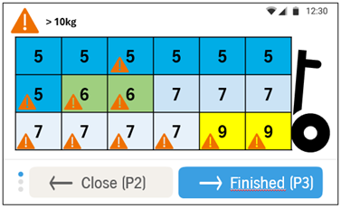

# Phase 1 — the screen inventory

What screens overstapelen needs, what each is for, and which are blocked on
something. **This is a scoping document, not a design.**

Scope, stated precisely, because the line matters: this document **does not
compose screens** — no layouts, no arrangement, no proposed wording. It **does**
name existing screens and components to follow, with their dimensions, where the
design system has already answered the question. Citing `Verify_load_carrier` as
the model for confirming a cart is scoping; deciding what our version looks like
is design, and belongs in a specification rather than here.

That restraint is the point. [ADR 0004](decisions/0004-position-map-over-per-crate-scan.md)
records that the position-map direction was set by a draft screen rather than by
floor observation, and warns that a drawing makes an unconfirmed decision look
settled. Listing the screens is useful now; drawing them mostly is not.

Any observed copy quoted below is **evidence from the file**, recording what
design already writes. It is not proposed wording for our screens.

Read with `docs/product-context.md` for the domain and `docs/ui-patterns.md` for
how Armscanner screens are composed.

## The flow, in the operator's terms

The operator arrives at the strekkenplein with a full picking cart, empties it
onto the strekkarren, and moves to the next cart. Phase 1 supports exactly that:

1. Scan **any** crate on the cart.
2. The app resolves the cart and shows where each crate belongs.
3. The cart is emptied.
4. Confirm, and go again.

Everything below is either a step in that loop, a way the loop fails, or an
interruption to it.

## The inventory

`Ready` means it can be specified now. `Blocked` names what it waits on.

| # | Screen | Purpose | Status |
| --- | --- | --- | --- |
| 1 | **Scan prompt** | Resting state. Tells the operator to scan any crate on the cart. | **Ready** — `Collect_default` is the model |
| 2 | **Scanning / resolving** | Feedback between scan and answer. May be sub-second and not a screen at all. | **Ready** |
| 3 | **Position map** | The cart drawn as positions, each showing its strek. The core screen. | **Ready, provisionally** — ADR 0004 accepted on assumptions; see below |
| 4 | **Cart complete** | Confirms the cart is empty and returns to (1). | **Ready** — `Verify_load_carrier` is the model |
| 5 | **Unknown crate** | Scanned crate resolves to no cart. | **Ready** — follow the error toast |
| 6 | **Wrong cart** | Scanned crate belongs to a different cart than the one in progress. | **Ready** — follow the error toast |
| 7 | **Cart already done** | The cart was already emptied, by this operator or another. | **Blocked** — needs a product decision |
| 8 | **Backend unavailable** | What the operator sees when the app cannot answer. | **Blocked** — open question 4 |
| 9 | **Interruptions** | Break, quit, resume, freezer check. | **Ready** — reuse, do not invent |
| 10 | **Onboarding** | Three-screen introduction, shown on first use. | **Ready** — house pattern, see below |

Seven of ten are ready to specify, and screen 3 is provisionally ready as of
2026-09-11. The two that are not are screens 7 and 8 — the difference between an
app the floor trusts and one it works around.

**Screen 10 was not in the first version of this list, and should have been.**
Every flow in the designs file ships `Onboarding_1/2/3` — a three-screen
carousel with a 145×145 illustration and `_🖇️Pagination - Pantry`, paged with
`P1`. Against a workforce that is ~92% flex with continuous onboarding, and a
constraint that says training cannot be a dependency, skipping this would be a
deliberate departure from house style. It is also entirely unblocked.

## What each blocker actually is

### Screen 3 — provisionally unblocked, on recorded assumptions

**Updated 2026-09-11.** The original source brief and its draft screen were read
in full. They answer enough of what was blocking this screen that
[ADR 0004](decisions/0004-position-map-over-per-crate-scan.md) has moved to
**Accepted, provisionally** — and the assumptions that acceptance rests on are
enumerated there, as A1–A5.

Be precise about what happened, because it is easy to overstate. The brief and
the draft are the **origin** of the position-map direction, not independent
evidence for it. What changed is that we chose to build against the direction
while the floor question remains open, rather than hold the screen. The
assumptions are written down; that is the mitigation.

#### Settled enough to specify against

- **18 positions, in a 3×6 grid.** Counted from the draft.
- **About 4 streks per cart.** Four distinct values in the example.
- **Colour and number together.** Every cell carries both. The number is
  load-bearing and must never be dropped — see ADR 0004 *Consequences*.
- **Orientation via the drawn cart.** Wheel and handle at the right edge.
- **A `> 10kg` weight flag per position**, with a legend at the top of the
  content region. This is new information: a position carries **two** attributes,
  not one.

#### A correction worth keeping

An earlier version of this document warned that at 18 positions "the strek
numbers stop being readable within the 232px content region", and used that to
argue the whole approach might have to give. **The draft renders 18 positions at
roughly device proportions and they are perfectly legible.** The concern was an
inference stated with more confidence than it had earned, and the number it
worried about turns out to be the actual number.

The colour claim held up better: four streks is right at the boundary where
adjacent hues stay distinguishable, which is why the double-encoding matters.

#### Still open

- **A1 — do crates stay in their picked positions?** Unchanged, unobserved, and
  still the thing that reverses the decision. Now the *only* blocker rather than
  one of four.
- **Why a map rather than `Verify_load_carrier`?** Design still owes an answer.
  Accepting ADR 0004 stops this blocking specification; it does not retire it.
- **Does the operator approach from a consistent end?** The drawn cart handles
  *conveying* orientation; it does not establish that orientation is stable.
- **Is this screen also screen 4?** The draft's button bar reads
  `← Close (P2)` / `→ Finished (P3)`, so completion may be an action on the map
  rather than a separate screen. See the note under screen 4 below.
- **What are the three dots at the left of the button bar?** If that is
  `_🖇️Pagination - Pantry`, the draft is already paging something, which would
  contradict the no-paging assumption in `docs/ui-patterns.md`. Confirm before
  building on either reading.

### Screen 4 — may not be a separate screen

Added 2026-09-11. The draft position map carries `→ Finished (P3)` in its own
button bar, which suggests cart completion is an **action on the map** rather
than a screen of its own.

If that holds, screens 3 and 4 merge and `Verify_load_carrier` stops being the
model — the map already shows the contents, so a second contents screen is
redundant. If it does not hold, `Finished (P3)` is simply the transition *into*
screen 4 and the inventory is unchanged.

Cheap to settle and worth settling early, because it changes whether the
confirming interaction has anywhere to live. ADR 0004 requires that "how
completion is confirmed" stays a reachable step in the flow rather than an
assumption baked into the screen — merging 3 and 4 must not quietly remove it.

### Screens 5–7 — the error convention already exists

An earlier draft of this document said there was no error precedent. That was
wrong, and the mistake is instructive: `00. System states` is a **section
header** with no children, and its content lives in the `↳ Error toast` and
`↳ Warning` pages listed beneath it. There are 20 screens between them.

The convention is two-tier, and screens 5 and 6 should follow it rather than
invent anything:

- **`🧬 Toast`** in the bottom region, 518×56 at 534 (80 for two lines), for a
  recoverable error the operator corrects and continues past. A
  `🧬 Toast with location` variant pairs an `attention` icon with
  `Product location - Pantry`, so the error can say *where to go* — directly
  useful for "this crate belongs to the cart over there".
- **`🧬 Dialog - Feedback`** as a modal, 502×284, for something that must be
  acknowledged before continuing.

Screen 5 (unknown crate) and screen 6 (wrong cart) are both recoverable, so both
are toasts, and both are specifiable now.

Screen 7 still needs a **product** decision, not a design one: if a cart is
already marked done, is that recoverable (toast) or must it be acknowledged
(modal)? The answer depends on whether two operators can work the same
strekkenplein at once, which nobody has confirmed.

### Screen 8 — the same hole as open question 4

`docs/product-context.md` asks what the agreed fallback is when the app is
unavailable, and lists *"the floor does not stop"* as non-negotiable. The
toast/warning split above covers a **bad scan**; a backend outage is a different
failure, and nothing in the file addresses it. Until Operations agrees the
fallback, this screen cannot be specified — it is a screen that describes a
process we have not defined.

## What can be done now, and why it is worth doing

Screens 1, 2, 4, 5, 6, 9 and 10 do not depend on cart geometry or on ADR 0004
being confirmed. They are the frame around the map: how the operator learns the
flow, starts it, knows the app heard them, recovers from a bad scan, finishes,
and takes a break.

**Screen 3 joined them on 2026-09-11**, provisionally — see above. It is the only
one whose specification carries assumption risk, so specify it last and mark the
numbers it depends on. The frame screens are safe regardless of how the floor
visit goes; the map is not.

**Almost all of them now have a named model to copy**, which was not true when
this document was first written:

| Screen | Follow |
| --- | --- |
| 1 Scan prompt | `Collect_default` — heading plus *"Scan or add manually"* |
| 4 Cart complete | `Verify_load_carrier` — contents plus a confirming checkbox |
| 5, 6 Scan errors | `🧬 Toast` / `🧬 Toast with location` in the bottom region |
| 9 Interruptions | `↳ Break / Quit activity`, reused wholesale |
| 10 Onboarding | `Onboarding_1/2/3`, three screens paged with `P1` |

That changes the nature of the specification work. It is now mostly **matching
an existing flow**, not inventing one — which is faster, far easier for design
to review, and much less likely to produce something the floor rejects as
unfamiliar.

Screen 9 should be **reuse, not design**. `↳ Break / Quit activity` already
draws break, quit, resume and freezer-check for both device sizes. The only open
question is which dialog components are current, since some of those screens use
`[OLD]` variants the library says not to use.

## Explicitly out of scope for this list

- **Phase 2, the reject lane.** Identical flow with cart mapping from a
  different source. The only thing Phase 1 owes it is putting cart mapping
  behind an interface — an architectural obligation, not a screen.
- **Task selection and division selection.** Whether overstapelen is reached
  through the existing task list is unconfirmed, and `↳ Select division` is
  empty in Figma. Both belong to the surrounding app rather than to this flow.
- **Any per-crate confirmation.** ADR 0004 option (c) adds one scan per
  strekkar and is the named fallback if position drift turns out to be real.
  Not designed now, but the flow should not be shaped so as to make it
  expensive to add later.

## Questions this raises

**Updated 2026-09-11.** The source brief and draft screen answered several of
these provisionally. Answered ones are struck through with the working answer
recorded — they are assumptions to verify on the floor, not closed questions.
See ADR 0004 A1–A5.

For the floor visit:

1. ~~How many positions does a picking cart have?~~ **Assume 18 (3×6).** Verify.
2. ~~How many streks does a typical cart span?~~ **Assume about 4.** Verify — the
   colour encoding stops working much beyond this.
3. Do crates stay in their picked positions between picking and the
   strekkenplein? (ADR 0004's confirming question — **still open, and still the
   one that reverses the decision**.)
4. ~~Is the cart always approached from the same end?~~ **Assume yes**, with the
   drawn cart as the landmark. Verify — a mirrored map fails silently.
5. Can two operators work the same strekkenplein simultaneously?
11. Are heavy crates (`> 10kg`) common enough that flagging roughly half the
    positions, as the draft does, still carries meaning? A warning on everything
    is a warning on nothing.

For design:

6. Does the toast/warning convention extend to a **backend outage**, or does
   that need a third treatment?
7. Which dialog components are current, given `[OLD]` variants are in use —
   including on the `↳ Warning` screens themselves?
8. What were `Load Carrier`'s `To map` / `Mapped` / `Not to map` states drawn
   for, and does a cart-mapping screen exist anywhere we have not looked?
9. **Why is a position map better than `Verify_load_carrier`?** Design has
   already solved "confirm the contents of a load carrier" as a list. We should
   be able to answer this before proposing a map. **Still open** — ADR 0004 being
   accepted does not answer it.
10. What are the agreed NL/ENG terms for `strek`, `strekkar` and
    `strekkenplein`? `kar` and `ladingdrager` are already established.
12. What are the three dots at the left of the draft's button bar? If it is
    `_🖇️Pagination - Pantry`, something is paging and `docs/ui-patterns.md` is
    wrong about this flow.
13. Is `Finished (P3)` an action on the map, or the transition into a separate
    screen 4?

For Operations:

8. What is the agreed fallback when the app is unavailable?
14. Where does the per-crate weight come from, and is it reliable enough to
    present as a safety signal?
15. Is the manual HSC in Phase 1 scope, or is the pilot mechanised-only?
